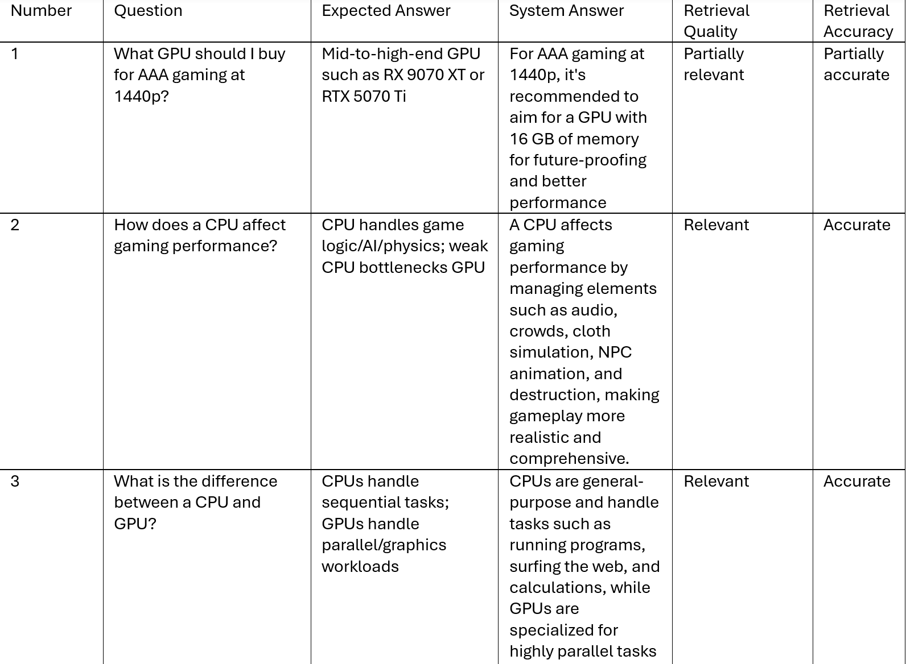
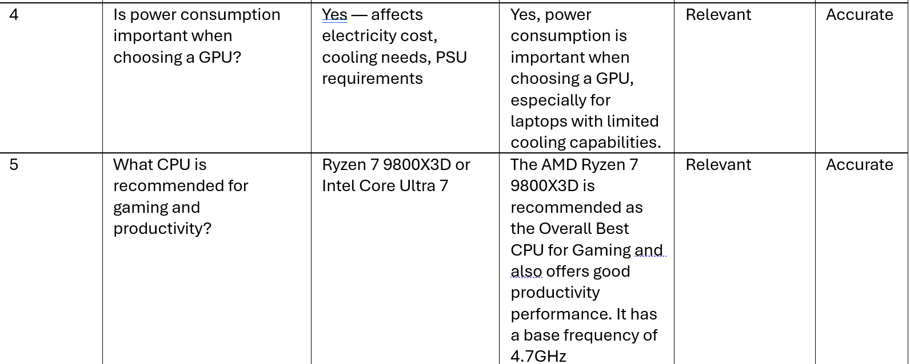

# The Unofficial Guide — Project 1

> **How to use this template:**
> Complete each section *after* you've built and tested the corresponding part of your system.
> Do not write placeholder text — if a section isn't done yet, leave it blank and come back.
> Every section below is required for submission. One-liners will not receive full credit.

---

## Domain

<!-- What topic or category of knowledge does your system cover?
     Why is this knowledge valuable, and why is it hard to find through official channels?
     Example: "Student reviews of CS professors at [university] — useful because official
     course descriptions don't reflect teaching style, exam difficulty, or workload." -->

     The main domain is about choosing the right GPU and CPU based on different factors such as power, performance, power-to-performance ratio. For instance, if someone would like to play AAA game and have little to no knowledge, the individual will have a hard time finding the right component for his/her PC. 
---

## Document Sources

<!-- List every source you collected documents from.
     Be specific: include URLs, subreddit names, forum thread titles, or file names.
     Aim for variety — sources that together cover different subtopics or perspectives. -->

| # | Source | Description | URL or location |
|---|--------|-------------|-----------------|
| 1 | Lenovo | A web article | https://www.lenovo.com/us/en/glossary/what-is-graphics-card/ |
| 2 | PC Gamer| A web article | https://www.pcgamer.com/the-best-graphics-cards/ |
| 3 | IBM | A web article | https://www.ibm.com/think/topics/gpu |
| 4 | CaseGuard | A web article | https://caseguard.com/articles/graphics-cards-why-choosing-the-right-one-matters/ |
| 5 | IBM | A web article | https://www.ibm.com/think/topics/central-processing-unit |
| 6 | Solarwinds | A web article | https://www.solarwinds.com/resources/it-glossary/what-is-cpu |
| 7 | Tom's Hardware | A Web Article | https://www.tomshardware.com/reviews/best-cpus,3986.html |
| 8 | Intel | A web article | https://www.intel.com/content/www/us/en/gaming/resources/how-cpus-affect-your-gaming-experience.html |
| 9 | Intel | A web article | https://www.intel.com/content/www/us/en/products/docs/processors/cpu-vs-gpu.html |
| 10 | AMD | A web article | https://www.amd.com/en/blogs/2025/why-your-host-cpu-matters-more-than-you-think--ma.html |

---

## Chunking Strategy

<!-- Describe your chunking approach with enough specificity that someone else could reproduce it.
     Include:
     - Chunk size (characters or tokens) and why that size fits your documents
     - Overlap size and why (or why not) you used overlap
     - Any preprocessing you did before chunking (e.g., stripping HTML, removing headers)
     - What your final chunk count was across all documents -->

**Chunk size:**
Chunking size 500 characters. This will be approximately 80-100 words. This chunking strategy can cover the whole scope of the question about GPUs or CPUs.
**Overlap:**
50 characters. Overlap prevents key information from being lost at chunk boundaries.
For example, if a paragraph about GPU power consumption spans two chunks, the 50-character
overlap ensures that both chunks contain enough shared context that either one can be retrieved by a relevant query. 
**Why these choices fit your documents:**
The 500-character window fits the typical paragraph length as my articles do not include anything special, and the 50-character overlap provides a safety margin for
information that straddles boundaries. Before chunking, I have copied and pasted the text elements from the articles to answer potential questions in a text file.
**Final chunk count:**
231
---

## Embedding Model

<!-- Name the embedding model you used and explain your choice.
     Then answer: if you were deploying this system for real users and cost wasn't a constraint,
     what tradeoffs would you weigh in choosing a different model?
     Consider: context length limits, multilingual support, accuracy on domain-specific text,
     latency, and local vs. API-hosted. -->

**Model used:**
sentence-transformers/all-MiniLM-L6-v2, loaded locally via the sentence-transformers
library. This model was chosen because it runs entirely on-device with no API key or rate
limits, is fast enough to embed hundreds of chunks.
**Production tradeoff reflection:**

---

## Grounded Generation

<!-- Explain how your system enforces grounding — how does it prevent the LLM from answering
     beyond the retrieved documents?
     Describe both your system prompt (what instruction you gave the model) and any structural
     choices (e.g., how you formatted the context, whether you filtered low-relevance chunks).
     Do not just say "I told it to use the documents" — show the actual instruction or explain
     the mechanism. -->

**System prompt grounding instruction:**
You are a helpful PC hardware advisor for people who want to choose the right GPU or CPU.

Answer the user's question using ONLY the information provided in the CONTEXT section below.
- If the context contains a clear answer, give a specific, helpful response.
- If the context does not contain enough information to answer the question, say exactly:
  "I don't have enough information in my sources to answer that."
- Do NOT use your general training knowledge about hardware.
- Do NOT make up product names, benchmarks, or specifications.

**How source attribution is surfaced in the response:**

---

## Evaluation Report

<!-- Run your 5 test questions from planning.md through your system and record the results.
     Be honest — a partially accurate or inaccurate result that you explain well is more
     valuable than a suspiciously perfect result. -->

| # | Question | Expected answer | System response (summarized) | Retrieval quality | Response accuracy |
|---|----------|-----------------|------------------------------|-------------------|-------------------|

**Retrieval quality:** Relevant / Partially relevant / Off-target  
**Response accuracy:** Accurate / Partially accurate / Inaccurate

---

## Failure Case Analysis

<!-- Identify at least one question where retrieval or generation did not work as expected.
     Write a specific explanation of *why* it failed, tied to a part of the pipeline.

     "The answer was wrong" is not an explanation.

     "The relevant information was split across a chunk boundary, so retrieval returned
     only half the context — the model didn't have enough to answer correctly" is an explanation.

     "The embedding model treated the professor's nickname as out-of-vocabulary and returned
     results from an unrelated review" is an explanation. -->

**Question that failed:**
What GPU should I buy for AAA gaming at 1440p?
**What the system returned:**
For AAA gaming at 1440p, it's recommended to aim for a GPU with 16 GB of memory for future-proofing and better performance
**Root cause (tied to a specific pipeline stage):**
It is tied to fixed-size chunking, that is not compatible enough to handle much information. The model then lacks enough information to answer fully, or gives a vague response.
**What you would change to fix it:**
Use another type of chunking strategy to handle more cases. 
---

## Spec Reflection

<!-- Reflect on how planning.md shaped your implementation.
     Answer both questions with at least 2–3 sentences each. -->

**One way the spec helped you during implementation:**
Without chunking strategy, it would have been easy to defer the chunk size decision and end up with an arbitrary default that didn't match the document structure. Planning the chunk size beforehand was helpful to generate meaningful answers to potential questions.
**One way your implementation diverged from the spec, and why:**
The original idea was to implement web-scraper to extract the information from the given sources, but some of the websites implemented JavaScript rendering that requests cannot access, which would have produced empty or partial documents.
---

## AI Usage

<!-- Describe at least 2 specific instances where you used an AI tool during this project.
     For each: what did you give the AI as input, what did it produce, and what did you
     change, override, or direct differently?

     "I used Claude to help me code" is not sufficient.
     "I gave Claude my Chunking Strategy section from planning.md and asked it to implement
     chunk_text(). It returned a function using a fixed character split. I overrode the
     chunk size from 500 to 200 because my documents are short reviews, not long guides." -->

**Instance 1**

- *What I gave the AI:*
Input to Claude: the Documents section and Chunking Strategy section from planning.md,
along with the list of 10 source URLs and the pipeline architecture diagram.
- *What it produced:*
Claude produced a complete ingest.py with fetch_html(), clean_html(), and
chunk_text() functions targeting 500-character chunks with 50-character overlap.
- *What I changed or overrode:*
Instead of using web-scraper, I decided to implement the chunking strategy using text documents.

**Instance 2**
- *What I gave the AI:*
Input to Claude: the Retrieval Approach section from planning.md, the pipeline diagram
(ChromaDB + all-MiniLM-L6-v2 + Groq Llama), and the grounding requirement
- *What it produced:*
Claude produced embed.py.
- *What I changed or overrode:*
Those files had bugs that had to be fixed. Therefore, I have made changes in embed.py.
